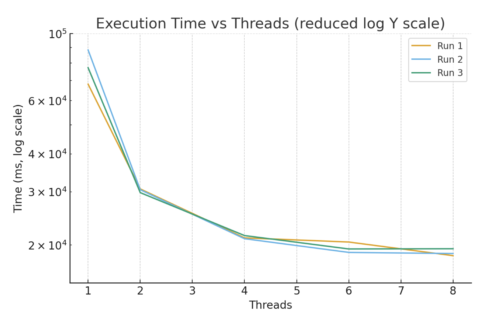
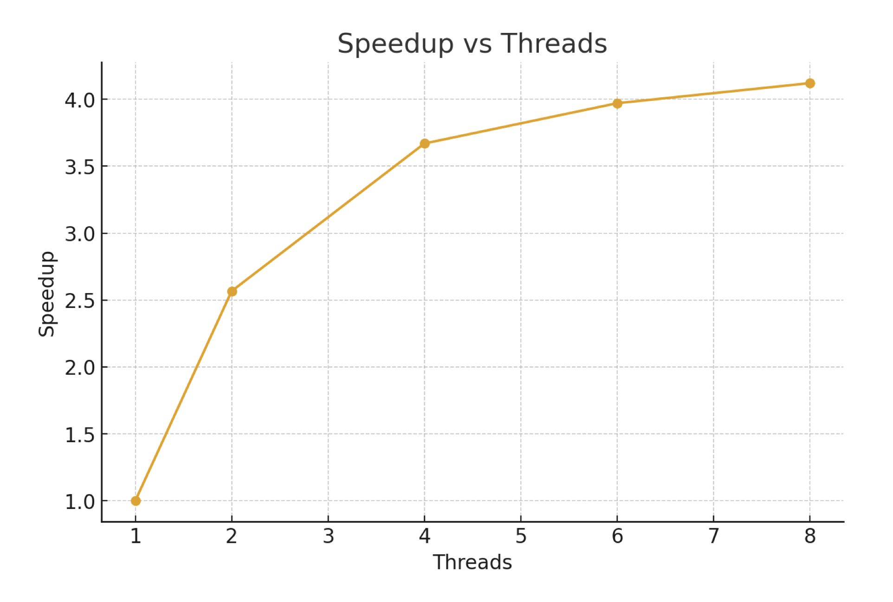

# News Aggregator

## 1.Notes

This project allowed me to experiment different strategies for parallelism.
However, the large dataset gave me some trouble when trying to debug my code, as I had to constantly
reduce the dataset size to test my functions or look for the cause of problems in thousands of files. Yet it was needed to actually test scalability and performance.

## 2. Parallel Processing Strategy

The goal was to parallelize as much of the code as possible. The processing pipeline consists of multiple
stages with synchronization barriers between them.

2.1 Initialization Stage

The DataBaseInit class reads small configuration files sequentially:

```
Categories
Languages
Linking words
List of article files to process
```
Worker threads are then created and initialized.

2.2 File Reading Stage

Each thread is statically assigned a subset of files based on its thread index.

**Sequential Database Structure:**

```
public class SequentialDataBase {
private final Set<NewsArticle> articleSet;
// category mappings
private final Map<String, List<String>> categoryToArticle;

// language mappings
private final Map<String, List<String>> languageToArticle;

// statistics
private final Map<String, Integer> keyWordsOccurrences;
private final Map<String, Integer> authorOccurrences;

// most recent article
private NewsArticle mostRecentArticle;
}
```
**Reading:**

Each thread reads its assigned files using Jackson JSON parser
Articles are added to the shared a local db
Duplicate tracking: titles and UUIDs are mapped to occurrence counts

**Synchronization:** Threads wait at a barrier until all files are read, as local dbs are thread-safe. The barrier is
need to ensure all threads complete reading before next stage.

2.3 Duplicate Removal Stage

The master thread reduces all duplicate counts from local dbs into global maps for titles and UUIDs.

**Synchronization:** Threads wait at a barrier to ensure duplicates are removed.

2.4 Processing Stage

Each thread will process its local database to build mappings and remove duplicates.

**Processing:**

Each threads removes duplicates from its local db based on global counts
Each thread processes its article subset (files previously read) to build:
Categorizes articles by category and language
Counts keyword and author occurrences
Tracks most recent article
Sorts category and language lists within its subset as well as the article set

2.5 Data Merge Stage

Partial databases are merged into the Main Database statically(each thread merges a subset of tasks).

**Merging:**

```
public List<MergeFunction> getMergeOperations() {
    return List.of(
        this::mergeCategories,
        this::mergeAuthor,
        this::mergeMostRecentArticle,
        this::mergeLanguages,
        this::mergeKeyWords
        );
}
```

Category and Language Merging: Merges sorted lists using k-way merge algorithm
Keyword and Author Merging: Merges occurrence counts by summing values for each key
Most Recent Article: Compares and updates the most recent article

**Synchronization:** Threads wait at a barrier to ensure merging is complete.

2.6 Writing Stage


**Embarrassingly Parallel:**

* Category files: Each thread writes a subset of category files
* Language files: Each thread writes a subset of language files

**Partial Parallelization:**

 * all_articles.txt and keywords_count.txt cannot be fully parallelized
 * Each thread writes its own partial file
 * articles are already in sorted order (due to ConcurrentSkipListSet)
 * keywords are sorted using k-way merge algorithm during previous stage
 * files prefixed with thread index (e.g., 0_all_articles.txt) are created with partial results
**Synchronization:** Threads wait at a barrier to ensure all writing is complete.

2.7 File Merge Stage

The master thread performs final operations:

* Concatenates partial i_all_articles.txt files
* Concatenates partial i_keywords_count.txt files
* Writes final reports


**Results**

Test Environment

```
    Component Specifications
    CPU AMD Ryzen 7 4700U with Radeon Graphics
    Total CPU(s) 8
    Physical Cores 8
    Threads per Core 1
    Virtualization Support AMD-V
    Hypervisor Vendor Microsoft (WSL2 environment)
    Total RAM 3.6 GiB
    Free RAM ~2.6 GiB
    Operating System Ubuntu 24.04.2 LTS
    Java Version Java™ SE 25.0.1 LTS (build 25.0.1+8-LTS-27)
```
**Test Dataset**

The datatset used was TEST_4_DATASET(test_4/articles.txt and test_4/input.txt): 11031 article files.

**Execution Time and Speedup**






**Observations**

* The performance increases rapidly from 1 - 4 threads, after which the improvement starts to slow down
* Beyond 6 threads, execution time only improves slightly—indicating that parallelism starts reaching its
limit
* This plateau may be caused by heavy file I/O, the overhead from inserting the initial data in the db, as
well as having more threads than merge operations in the merging stage, therefore, some threads
remain idle, while others are busy.
* The best overall execution time is achieved with **8 threads** , but the most efficient balance between
speed and overhead occurs at **4 threads** on this system.


